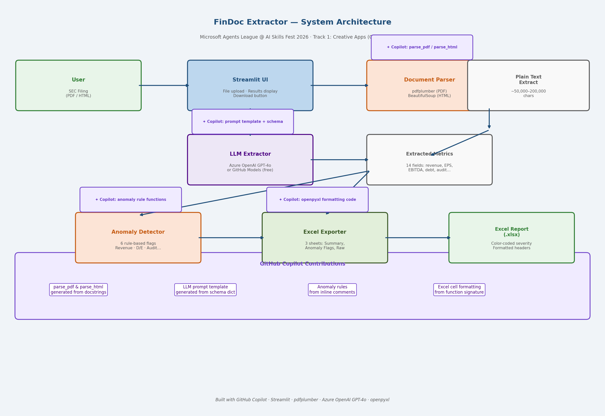

# 📄 FinDoc Extractor

> **Microsoft Agents League @ AI Skills Fest 2026 — Track 1: Creative Apps (GitHub Copilot)**

FinDoc Extractor is a Python web application that reads SEC filings (10-K and 10-Q) and automatically extracts key financial metrics, computes year-over-year changes, flags anomalies, and exports a formatted Excel report — all powered by GPT-4o and built with GitHub Copilot.

---

## Problem Statement

Analysts spend hours manually reading hundreds of pages of SEC filings to extract a handful of financial figures. FinDoc Extractor automates this process: upload a filing, get structured metrics and anomaly flags in seconds.

---

## Features

| Feature | Description |
|---|---|
| PDF & HTML Parsing | Handles both PDF and raw HTML SEC filings from EDGAR |
| LLM-Powered Extraction | GPT-4o extracts 14 financial metrics with a structured JSON schema |
| Anomaly Detection | 6 rule-based flags: revenue drops, negative EBITDA, audit qualifications, D/E ratio spikes |
| Excel Export | 3-sheet formatted report: Summary, Anomaly Flags (color-coded by severity), Raw Metrics |
| GitHub Models Support | Works with free GitHub Models endpoint (no Azure subscription required) |

---

## Tech Stack

- **UI:** Streamlit
- **PDF Parsing:** pdfplumber
- **HTML Parsing:** BeautifulSoup4 + lxml
- **LLM Extraction:** Azure OpenAI GPT-4o (or GitHub Models — free)
- **Data Processing:** pandas
- **Excel Export:** openpyxl
- **Development:** GitHub Copilot (VS Code)

---

## GitHub Copilot Usage

GitHub Copilot was a core development tool throughout this project. Key examples:

### 1. Parser functions — generated from docstrings
```python
def parse_html(file_bytes: bytes) -> str:
    """Strip HTML tags from an SEC filing and return clean plain text."""
    # Copilot generated the full implementation including BeautifulSoup
    # decompose() calls for script/style tags from this docstring alone
```

### 2. Anomaly rules — generated from inline comments
```python
# flag if revenue dropped more than 20% year over year
# Copilot generated the full YoY calculation, null guard, and dict structure
```

### 3. Excel formatting — generated from function signature + docstring
```python
def build_excel_report(metrics: dict, anomalies: list[dict]) -> bytes:
    """Generate a formatted 3-sheet Excel workbook with Summary, Anomaly Flags, and Raw Metrics."""
    # Copilot generated the openpyxl PatternFill, Font, and Alignment styling
    # for alternating row colors and severity-coded cells
```

### 4. LLM prompt template — generated from schema dict
After defining `EXTRACTION_SCHEMA`, Copilot suggested the full prompt template including the instruction to return null for missing values and the monetary unit normalization instruction.

---

## Architecture



---

## Setup

```bash
# 1. Clone the repo
git clone https://github.com/YOUR_USERNAME/Findocextractor.git
cd Findocextractor

# 2. Install dependencies
pip install -r requirements.txt

# 3. Configure credentials
cp .env.example .env
# Edit .env with your Azure OpenAI key OR set USE_GITHUB_MODELS=true + GITHUB_TOKEN

# 4. Run
streamlit run app.py
```

### Using GitHub Models (Free)
Set these in your `.env`:
```
USE_GITHUB_MODELS=true
GITHUB_TOKEN=your_github_personal_access_token
AZURE_OPENAI_DEPLOYMENT=gpt-4o
```

---

## Test with Real Filings

Download filings from [SEC EDGAR](https://www.sec.gov/cgi-bin/browse-edgar):
1. Go to EDGAR full-text search
2. Search any public company (e.g., Apple, Microsoft)
3. Select a 10-K or 10-Q filing
4. Download the HTML or PDF version
5. Upload to FinDoc Extractor

---

## Anomaly Rules

| Rule | Severity | Trigger |
|---|---|---|
| Revenue Decline > 20% | HIGH | YoY revenue drop exceeds 20% |
| Revenue Decline > 5% | MEDIUM | YoY revenue drop between 5–20% |
| High Debt-to-Equity | MEDIUM | D/E ratio exceeds 3.0x |
| Negative EBITDA | HIGH | EBITDA < 0 |
| Swing to Net Loss | HIGH | Prior year profitable, current year loss |
| Audit Issue | CRITICAL | Qualified / Adverse / Going Concern opinion |
| Negative EPS | MEDIUM | Diluted EPS < 0 |

---

## Project Structure

```
Findocextractor/
├── app.py                  # Streamlit UI
├── extractor/
│   ├── parser.py           # PDF + HTML document ingestion
│   ├── llm_extract.py      # GPT-4o structured extraction
│   ├── anomaly.py          # Rule-based anomaly detection
│   └── excel_export.py     # Formatted Excel report generation
├── architecture.png        # System architecture diagram
├── requirements.txt
└── .env.example
```

---

## License

MIT

---

*Built for Microsoft Agents League @ AI Skills Fest 2026 — Track 1: Creative Apps*  
*Developed with GitHub Copilot in VS Code*
